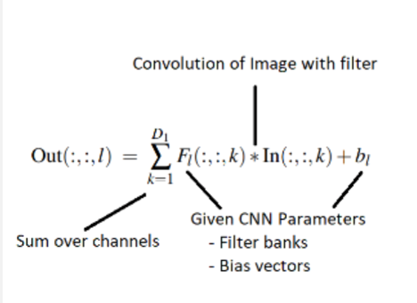

# Convolutional Neural Network for Object Detection

## Project Overview
This project involves implementing the forward pass of an 18-layer Convolutional Neural Network (CNN) in MATLAB for object detection. The goal is to classify 32x32x3 images into one of ten categories, focusing on the application of image filters and powerful object detection algorithms.

### Features

**18-Layer CNN Architecture**: Implements a deep CNN with layers including image normalization, convolution, ReLU, max pooling, fully connected layers, and softmax.

**CIFAR-10 Dataset**: Utilizes the CIFAR-10 dataset for object classification, consisting of 10,000 color images in 10 different categories.

**MATLAB Implementation**: Entire project developed in MATLAB, adhering to the constraints and methodologies taught in class.

## Prerequisites
* MATLAB
* CIFAR-10 dataset (cifar10testdata.mat)
* CNN parameters file (CNNParameters.mat)

## Installation and Setup
1. Clone the repository to your local machine
2. Open MATLAB and navigate to the project directory.
3. Load the CIFAR-10 dataset and CNN parameters using the provided MATLAB scripts.

## Running the Project
This Convolutional Neural Network project is structured with individual MATLAB function files for each operation and a main.m file that orchestrates the overall execution. To run the project, follow these steps:

**Step 1: Set Up Your Environment**

* Ensure that MATLAB is installed on your system.
* Clone the repository or download the project files to your local machine.
* Place all the matlab files including the data files and layers in a project directory.

**Step 2: Open the Project**
* Open MATLAB.
* Navigate to the directory where you have saved the project files.

**Step 3: Run the Main Script**
* In MATLAB's command window, run the following command: "main"
* This will execute the main.m file, which calls the individual function files to perform the CNN operations.

**Step 4: Review the Output**
* After running main.m, the classification results for the images in the CIFAR-10 dataset will be displayed.
* The performance of the CNN can be evaluated using the generated confusion matrix.

**Note:**
Each function file (e.g., for convolution, ReLU, max pooling, softmax) is designed to be called from the main.m script. These files implement the specific operations required for each layer of the CNN.

## Project Structure
This project is organized with multiple MATLAB function files for each CNN operation and a central main.m script that integrates these functions. Here's an overview of the key components:

**[main.m](main.m)**: The main script that orchestrates the execution of the CNN. Run this file in MATLAB to perform the forward pass of the network on the CIFAR-10 dataset.

### Layer Implementations
Each layer of the CNN is implemented in individual MATLAB function files. Visual representations of each layer are included for better understanding.

* **[appyl_imnormalize.m](Layers/apply_imnormalize.m)**: Routine for image normalization.

* **[apply_relu.m](Layers/apply_relu.m)**: Routine implementing the ReLU function.

* **[apply_maxpool.m](Layers/apply_maxpool.m)**: Input is an array of size 2N ×2M ×D and output is an array of size N ×M ×D obtained by considering
the maximum values in subsections of the rows and columns. It effectively reduces the number of total
rows and columns by using the maximum to represent a patch of rows and columns.\

* **[apply_convolve.m](Layers/apply_convolve.m)**: The input array is of size N × M × D1 and the output is an array of size N × M × D2. Note that the
number of rows and columns is unchanged. The number of channels is what changes in the output.\
\

* **[apply_fullconnect.m](Layers/apply_fullconnect.m)**: Input is an array of size N × M × D1 and the output is an array of size 1 × 1 × D2. Similarl to
how the convolution layer works, the fully connected layer applies a filter bank of D2 filters and bias
values to generate an output vector.\

* **[apply_softmax.m](Layers/apply_softmax.m)**: Routine implementing the softmax function. This essentially turns the output of your
fully connected layer into a vector of probabilities. You can then classify the category based on this
vector by choosing the one with highest probability.\

* **[apply_CNN.m](Layers/apply_CNN.m)**: Routine that builds the Convolutional Neural Network by connecting all the layers defined above.

### Data Files
**CNNParameters.mat**: Parameters file containing the filter and bias vectors for convolution and fully connected layers.
**CIFAR-10 Dataset**:
The cifar10datatest.mat file, essential for running this project, is available in the Releases section of this GitHub repository. This file contains the CIFAR-10 dataset used for classification.

Accessing the Test Data File
To access and use the cifar10datatest.mat file:

1. Navigate to the Releases section of this repository.
2. Download the cifar10datatest.mat file from the latest release.
3. Place the downloaded file in the root directory of the project (same location as the main.m file).

### Overall Flowchart
A flowchart depicting how all the layers work together in the CNN is included for a comprehensive understanding of the network architecture.

## Evaluation
The performance of the CNN is evaluated using a confusion matrix, highlighting the accuracy and misclassifications across different categories. The [debuggingTest.mat](debuggingTest.mat) file is useful in debugging the CNN and ensuring proper functionality.

## Contributing
Contributions to this project are welcome. Please ensure to follow the existing code structure and update the documentation as needed.
